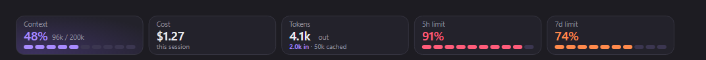
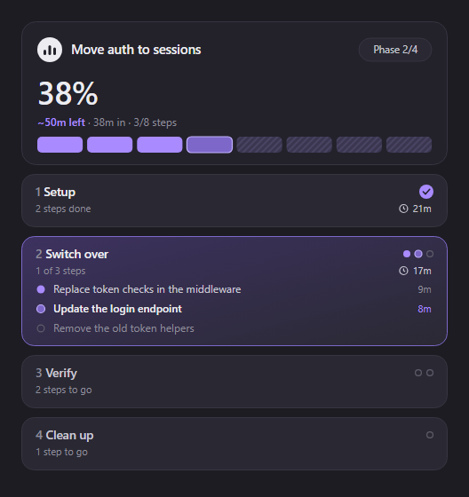
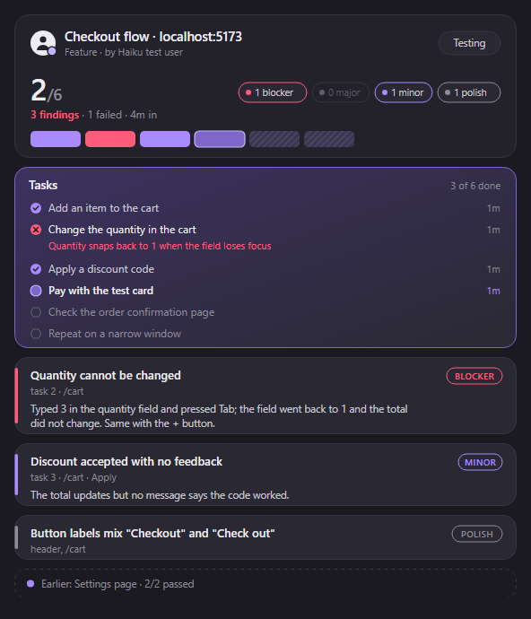

# claude-code-mods

My [Claude Code mods](https://code.claude.com/docs/en/plugins/mods/overview.md), one folder per mod. Needs Claude Code 2.1.287 or newer.

| Mod | What it does |
| --- | --- |
| [usage-band](usage-band) | A band above the prompt showing context fill, tokens, cost and rate limits: stat tiles in the desktop app, a coloured row in the terminal |
| [plan-progress](plan-progress) | Reads a phased plan into a live progress tree: phases, steps, elapsed time and an estimate of what is left |
| [test-user](test-user) | A Haiku test user that clicks through your locally running app and reports UI/UX issues: its task list, findings and failures in a live pane |

All three mods share one look: dark violet cards with a lilac accent. In the desktop app's Code tab they draw as images (cards, tiles, gradients); in the terminal they use the same colours as text.



## Install

At the prompt of a terminal Claude Code session:

```
/plugin install usage-band --marketplace WeaponizedLego/claude-code-mods
/plugin install plan-progress --marketplace WeaponizedLego/claude-code-mods
```

Answer `y` to add the marketplace, then pick the user scope. Or from a shell:

```bash
claude plugin marketplace add WeaponizedLego/claude-code-mods
claude plugin install usage-band@claude-code-mods
claude plugin install plan-progress@claude-code-mods
```

Update later with `claude plugin marketplace update claude-code-mods`, then `claude plugin update usage-band@claude-code-mods`.

## plan-progress



When a plan with several phases is approved in plan mode, the mod reads its phases and steps (`## Phase 1: ...` headings, other work headings, or a nested list) into a tree and opens it in a pane. In the terminal it looks like this:

```
Move auth to sessions                         20m in · ~40m left
▰▰▰▰▰▰▱▱▱▱▱▱▱▱▱▱▱▱ 33%  2/6 steps · phase 2/3

✓ 1 Setup                                                 20m
  ├ ✓ Add the sessions table                              10m
  └ ✓ Write the session store                             10m
● 2 Switch over
  ├ ● Replace token checks in the middleware
  ├ ○ Update the login endpoint
  └ ○ Remove the old token helpers
○ 3 Verify
  └ ○ Run the auth test suite
```

The status line carries the short form (`▰▰▱▱ 2/6 · phase 2/3: Switch over · 20m in · ~40m left`). Steps move when Claude calls the mod's `plan_mark` tool, or by themselves when Claude's tasks or todos are named like a step. Without plan mode, ask Claude to lay the work out in phases and it calls `plan_set`. The estimate is the pace so far times the steps left.

`/plan-progress` opens the tree (it also works mid-turn); `/plan-progress clear` stops tracking.

## test-user



A test user for the app you are running locally. Ask Claude to "test the app" (or a feature, a page, a flow) and it hands the job to `test-user:tester`, a subagent on Haiku that drives the app in the browser the way a person would: it works out what to test, finds the app (the URL you gave, `.claude/launch.json`, `package.json`), plans a handful of user tasks, works through them and reports each problem it sees. It never edits code, stays on localhost and only uses test data.

When you just say "test the app", Claude points it at the feature most recently built in the session; with nothing built, the tester looks at `git diff` and `git log` for a recent feature, and failing that tests the whole application.

The pane shows the run as it goes: status, tasks passed out of total, a count per severity (blocker, major, minor, polish), the task list with a note on each failure, a card per finding (worst first, with where and how to reproduce), a red card when it could not test at all, and earlier runs folded at the bottom. The status line carries the short form (`test-user ● 3/6 tasks · 2 findings · 4m · Pay with the test card`) and a toast says how it ended.

The session gets the full record, not just the tester's closing message: it rides back on the Agent result when the tester ran in the foreground, and on the next prompt (or the background task's notification) otherwise; `test_report` reads it any time. A tester whose turn ends early and is resumed carries on with the same run.

Claude gets the same reporting tools (`test_plan`, `test_task`, `test_finding`, `test_finish`), so a test it runs by hand shows in the pane too, and it can amend the latest tester run with what it re-checked. If the tester stops without a verdict, the record decides it; a "passed" never hides a failed task.

`/test-user` opens the pane; `/test-user run [what to test]` starts a run; `/test-user clear` forgets the runs.

## Adding a mod

Put it in its own folder (`<mod>/.claude-plugin/plugin.json`, `<mod>/hooks/...`) and add an entry to `.claude-plugin/marketplace.json`. Check it with `claude plugin validate .`.
